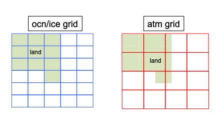
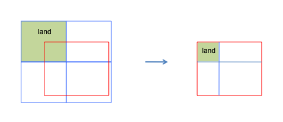
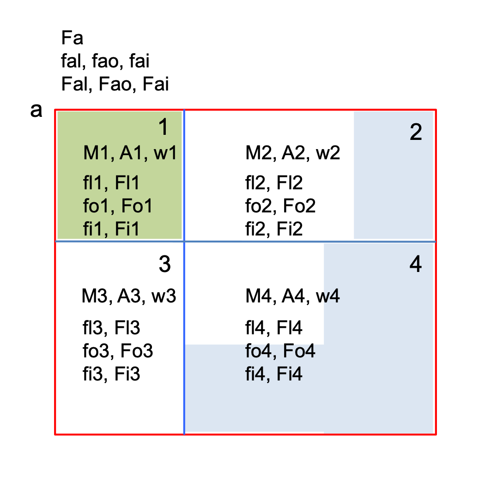

.. _conservation:

===============================================
Conservation, area corrections and accumulation
===============================================

Conservation of mass and energy is a defining requirement of the mediator: a
flux leaving one component must deposit the same integrated quantity in the
component that receives it, even after being mapped and merged across mismatched
grids and averaged over mismatched coupling intervals. Achieving this ties
together several details that must be considered *together* — mapping weights,
surface fractions, normalization, model-versus-ESMF areas, and accumulation.

CMEPS's mapping weights are **pure area-overlap weights**: each is the
fractional area a source cell contributes to a destination cell. Masking and
normalization are deliberately **not** folded into them. The reason is a split
between the static and the dynamic:

* the **weights are static geometry** — area overlaps between cells, computed
  once and reused every coupling step, and summing to one; whereas
* the **masking and normalization are dynamic** — they are done with the
  ocean/ice **surface fraction**, which changes in time as sea ice grows and
  melts (the ocean fraction is ``1 - ice fraction``).

A time-varying fraction cannot be precomputed into static weights, so it is
applied **at run time, every coupling step, when a field is mapped or merged**: a
partial-coverage field is fraction-weighted and normalized when mapped, and the
surface contributions are fraction-weighted when merged. (ESMF could fold a
*static* land/ocean mask into the weights, but that static mask cannot represent
the dynamic ice coverage that conservation depends on, and folding normalization
in would break the sum-to-one property besides.)

This page develops why that combination conserves; it is the principle that the
:ref:`mapping`, :ref:`merging` and :ref:`fractions <surface-fractions>` pages
that follow then implement, and it expands the conservation summary in
:ref:`concepts`.

The example below uses a single atmosphere cell ``a`` that overlaps four
ocean/ice cells ``1..4``; ``A`` is an overlap area, ``w`` a mapping weight, ``f``
a surface fraction, ``F`` a field, and subscripts ``l/o/i`` denote land, ocean
and ice.

The figures below make this setup concrete. In the most common CMEPS
configuration the ocean and sea-ice grids are identical, as are the atmosphere
and land grids, and the ocean/ice grid carries the mask that distinguishes
ocean/ice cells from land.

   Overlapping atmosphere and ocean/ice grids. Interpolating the ocean/ice mask
   onto the atmosphere/land grid sets the complementary land and ocean/ice masks
   there; the land model may make a single atmosphere cell part land, part ocean
   and part sea ice.

   Focusing on a single atmosphere cell ``a`` and the ocean/ice cells ``1..4``
   it overlaps.

   The labeling used throughout this page. Each overlap ``i`` has an area ``Ai``
   and a mask ``Mi`` (land green, ocean blue, sea ice white). On the atmosphere
   cell the land, ocean and ice fractions satisfy ``fal + fao + fai = 1``, and
   ``Fa`` is the merged gridcell-average field.

Conservative mapping weights
============================

CMEPS uses area-overlap conservative weights,

.. code-block:: none

   w1 = A1/Aa,  w2 = A2/Aa,  w3 = A3/Aa,  w4 = A4/Aa

which, being fractions of the atmosphere cell area, always sum to one:

.. code-block:: none

   w1 + w2 + w3 + w4 = 1

Applying the weights is a sparse matrix multiply, ``Xa = [W] Xo``. These same
weights map the ocean/ice mask to obtain the land fraction, and map the surface
fractions themselves (see :ref:`fractions <surface-fractions>`).

Fraction-weighted normalized mapping
====================================

Mapping a *masked* or *fraction-weighted* field — for example an SST that only
exists where there is ocean — cannot be done with a plain weighted average. A
direct average pulls in undefined land values; a mask-weighted average no longer
has weights that sum to one, so it is biased. The correct approach uses the
dynamically varying fraction exposed to the atmosphere:

.. code-block:: none

   fao = w1*fo1 + w2*fo2 + w3*fo3 + w4*fo4
   Fao = (fo1*w1*Fo1 + fo2*w2*Fo2 + fo3*w3*Fo3 + fo4*w4*Fo4) / fao

that is, the field is fraction-weighted, mapped, and then normalized by the
mapped fraction. In practice this is the four-step process implemented in
:ref:`mapping`:

.. code-block:: none

   Fo'  = fo * Fo                                   (a) fraction-weight the field
   fao  = w1*fo1 + w2*fo2 + w3*fo3 + w4*fo4          (b) map the fraction
   Fao' = w1*Fo1' + w2*Fo2' + w3*Fo3' + w4*Fo4'      (c) map the weighted field
   Fao  = Fao' / fao                                 (d) normalize by the mapped fraction

Steps (b) and (c) are the conservative sparse-matrix multiply; step (a)
fraction-weights the field and step (d) normalizes.

**Why it conserves.** Think of ``F`` as a flux and form the associated quantity.
On the ocean grid,

.. code-block:: none

   Qo = (fo1*Fo1*A1 + fo2*Fo2*A2 + fo3*Fo3*A3 + fo4*Fo4*A4) * dt

and on the atmosphere grid it is the mapped flux times the mapped fraction times
the atmosphere area,

.. code-block:: none

   Qa = fao * Fao * Aa * dt

Substituting the definitions of ``fao`` and ``Fao`` above (and ``w_i = A_i/Aa``)
gives ``Qo = Qa``: the integrated quantity is unchanged by the mapping.

Merging with fractions
======================

The field the atmosphere sees over the cell is the fraction-weighted merge of
the three surfaces,

.. code-block:: none

   Fa = fal*Fal + fao*Fao + fai*Fai,   with   fal + fao + fai = 1

Substituting the fraction-weighted normalized maps for ``Fao`` and ``Fai`` and
expanding, the whole expression collapses to a plain conservative mapping of the
field already merged *on the ocean grid*:

.. code-block:: none

   Fa = w1*(fl1*Fl1 + fo1*Fo1 + fi1*Fi1)
      + w2*(fl2*Fl2 + fo2*Fo2 + fi2*Fi2)
      + w3*(fl3*Fl3 + fo3*Fo3 + fi3*Fi3)
      + w4*(fl4*Fl4 + fo4*Fo4 + fi4*Fi4)

which is manifestly conservative. Notice that the normalization at the end of the
mapping (dividing by ``fao``) and the fraction weighting in the merge
(multiplying by ``fao``) **cancel**. CMEPS nonetheless keeps both, because the
normalized field ``Fao`` is a meaningful gridcell-average value — useful for
history and diagnostics and required whenever a field is mapped but *not* merged
(such as an interpolated SST) — whereas the un-normalized ``Fao'`` is a subarea
average that is far less intuitive.

Area corrections
================

The conservative weights above assume the overlap areas are computed
consistently. But each component computes its gridcell areas as part of its own
discretization (great-circle versus lon/lat approximations, different Earth radii,
and so on), and these **model areas do not, in general, match the ESMF areas**
used to build the mapping weights. Two grids can share identical cell corners and
centers yet disagree on area.

Because a flux carries a quantity proportional to the *model* area, the fluxes
must be corrected by the ratio of the model and ESMF areas. Outgoing fluxes are
multiplied by ``model_area / ESMF_area`` and incoming fluxes by
``ESMF_area / model_area``:

.. code-block:: none

   F1' = (A1m/A1) * F1        ! correct the source flux out of component 1
   F2' = w1 * F1'             ! map
   F2  = F2' * (A2/A2m)       ! correct into component 2

   => Q2 = F2*A2m = A1m*F1 = Q1

Three properties matter in practice:

* area corrections apply to **fluxes only** (not states);
* they are computed **once at initialization** and **do not vary in time**; and
* the model areas must be passed to the mediator at initialization so the
  corrections can be formed.

Accumulation and averaging
==========================

Components coupled at different frequencies require accumulation: a field is
accumulated over the fast coupling intervals and averaged before it is handed to
a component running on a slower interval. Two rules keep this conservative.

**Accumulate the fraction-weighted flux, not the pieces separately.** For a
fraction-weighted flux the accumulation must be of the product ``f*F``, because

.. code-block:: none

   sum_n(f*F)  !=  sum_n(f) * sum_n(F)

Accumulating the fraction and the flux separately and multiplying afterwards does
**not** give the correct time average and breaks conservation.

**Accumulation and mapping commute, so accumulate first and map once.** Both the
accumulation ``sum_n`` and the mapping ``map`` are linear operations, so

.. code-block:: none

   Fo = 1/n * sum_n( mapa2o(fao_a * Fao_a) )
      = mapa2o( 1/n * sum_n(fao_a * Fao_a) )

The fraction-weighted flux ``fao_a*Fao_a`` can therefore be accumulated on the
source (atmosphere) grid over the fast intervals and mapped **only once**, on the
slow coupling interval — the pattern the :ref:`run sequence <run-sequence>` uses
for the ocean (accumulate every fast step, average and send on the ocean
interval). CMEPS maintains dedicated accumulators for this
(``FBExpAccumOcn`` / ``FBExpAccumWav``; see :ref:`code-organization`).
