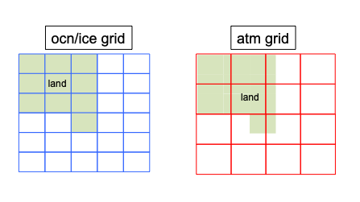
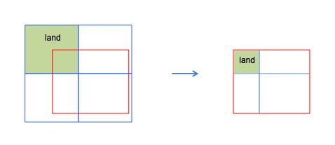
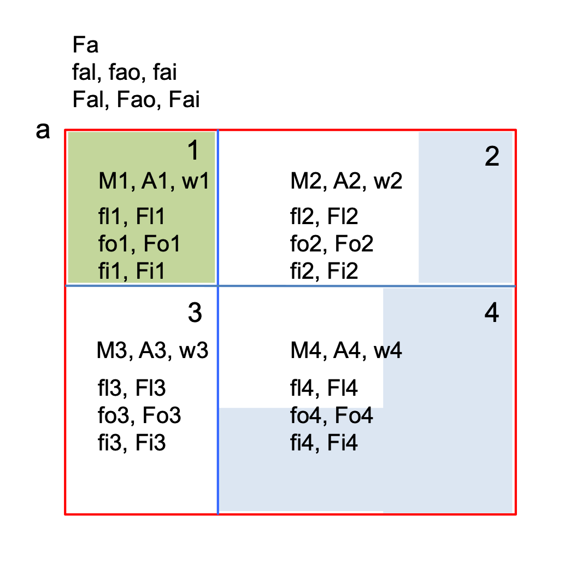

Introduction
============

CMEPS is a NUOPC-compliant mediator which uses ESMF to couple earth grid components in a hub and spoke system.

As a mediator, CMEPS is responsible  for transferring field information from one
model component to another. This transfer  can require one or more operations on
the transferred  fields, including  mapping of  fields between  component grids,
merging  of fields  between different  components and  time-averaging of  fields
over varying coupling periods.

Components share information via import  and export states, which are containers
for  ESMF data  types  that wrap  native  model data.  The  states also  contain
metadata, which  includes physical  field names,  the underlying  grid structure
and coordinates,  and information on  the parallel decomposition of  the fields.
Note that while CMEPS itself is  a mesh based mediator, component models coupled
by the CMEPS mediator can be either grid or mesh based.

Each component model  using the CMEPS mediator is serviced  by a NUOPC-compliant
cap. The NUOPC cap  is a small software layer between  the underlying model code
and  the mediator.  Fields  for  which the  mediator  has  created a  connection
between model components are placed in either  the import or export state of the
component within  the NUOPC cap.  The information contained within  these states
is then passed into  native model arrays or structures for  use by the component
model.

Field  connections  made  by  the  CMEPS mediator  between  components  rely  on
matching of  standard field names. These  standard names are defined  in a field
dictionary.  Since CMEPS  is a  community mediator,  these standard  names are
specific to each application.

   
Organization of the CMEPS mediator code
#######################################

When you check out the code you  will files, which can be organized into three
groups:

* totally generic components that carry  out the mediator functionality such as mapping, 
  merging, restarts and history writes. Included here is a a  "fraction" module that 
  determines  the fractions of different  source model components on every source 
  destination mesh.

* application specific  code that determines what fields  are exchanged between 
  components and how they are merged and mapped.

* prep phase modules  that carry out the mapping and merging  from one or more 
  source components to  the destination component.

=========================== ============================ ===========================
  Generic Code               Application Specific Code   Prep Phase Code
=========================== ============================ ===========================
med.F90                     esmFldsExchange_cesm_mod.F90 med_phases_prep_atm_mod.F90
esmFlds.F90                 esmFldsExchange_nems_mod.F90 med_phases_prep_ice_mod.F90
med_map_mod.F90             esmFldsExchange_hafs_mod.F90 med_phases_prep_ocn_mod.F90
med_merge_mod.F90           fd_cesm.yaml                 med_phases_prep_glc_mod.F90
med_frac_mod.F90            fd_nems.yaml                 med_phases_prep_lnd_mod.F90                          
med_internalstate_mod.F90   fd_hafs.yaml                 med_phases_prep_rof_mod.F90               
med_methods_mod.F90.                         
med_phases_aofluxes_mod.F90 
med_phases_ocnalb_mod.F90
med_phases_history_mod.F90
med_phases_restart_mod.F90
med_phases_profile_mod.F90
med_io_mod.F90
med_constants_mod.F90
med_kind_mod.F90
med_time_mod.F90
med_utils_mod.F90
=========================== ============================ ===========================

.. note:: Some modules, such as med_phases_prep_ocn.F90 and med_frac_mod.F90 also contain application specific-code blocks.

Mapping and Merging Primer
#######################################

This section provides a primer on mapping (interpolation) and merging of gridded
coupled fields.  Masks, support for partial fractions on grids, weights generation, 
and fraction 
weighted mapping and merging all play roles in the conservation and quality of the
coupled fields.

A pair of atmosphere and ocean/ice grids can be used to highlight the analysis.

The most general CMEPS mediator assumes the ocean and sea ice surface grids are 
identical while the atmosphere and land grids are also identical.  The ocean/ice
grid defines the mask which means each ocean/ice gridcell is either a fully
active ocean/ice gridcell or not (i.e. land).  Other configurations have been 
and can be implemented and analyzed as well.  

The ocean/ice mask interpolated to the atmosphere/land grid
determines the complementary ocean/ice and land masks on the atmosphere grid.
The land model supports partially active gridcells such that each atmosphere
gridcell may contain a fraction of land, ocean, and sea ice.

Focusing on a single atmosphere grid cell.

The gridcells can be labeled as follows.

The atmosphere gridcell is labeled "a".  On the atmosphere gridcell (the red box), 
in general,
there is a land fraction (fal), an ocean fraction (fao), and a sea ice fraction
(fai).  The sum of the surface fractions should always be 1.0 in these
conventions.  There is also a gridbox average field on the atmosphere grid (Fa).  
This could be a flux or a state that is 
derived from the equivalent land (Fal), ocean (Fao), and sea ice (Fai) fields.
The gridbox average field is computed by merging the various surfaces::

  Fa = fal*Fal + fao*Fao + fai*Fai

This is a standard merge where::

  fal + fao + fai = 1.0

and each surface field, Fal, Fao, and Fai are the values of the surface fields
on the atmosphere grid.

The ocean gridcells (blue boxes) are labeled 1, 2, 3, and 4 in this example.  
In general, 
each ocean/ice gridcell partially overlaps multiple atmosphere gridcells.  
Each ocean/ice gridcell has an overlapping Area (A) and a Mask (M) associated with it.
In this example, land is colored green, ocean blue, and sea ice white so just for
the figure depicted::

  M1 = 0
  M2 = M3 = M4 = 1

Again, the ocean/ice areas (A) are overlapping areas so the sum of the overlapping
areas is equal to the atmophere area::

  Aa = A1 + A2 + A3 + A4

The mapping weight (w) defined in this example allows a field on the ocean/ice
grid to be interpolated to the atmosphere/land grid.  The mapping weights can
be constructed to be conservative, bilinear, bicubic, or with many other
approaches.  The main point is that the weights represent a linear sparse matrix
such that in general::

  Xa = [W] * Xo

where Xa and Xo represent the vector of atmophere and ocean gridcells respectively,
and W is the sparse matrix weights linking each ocean gridcell to a set of atmosphere
gridcells.  Nonlinear interpolation is not yet supported in most coupled systems.

Mapping weights can be defined in a number of ways even beyond conservative
or bilinear.  They can be masked or normalized using multiple approaches.  The
weights generation is intricately tied to other aspects of the coupling method.  
In CMEPS, area-overlap conservative weights are defined as follows::

  w1 = A1/Aa
  w2 = A2/Aa
  w3 = A3/Aa
  w4 = A4/Aa

This simple approach which does not include any masking or normalization provides a 
number of useful attributes.  The weights always add up to 1.0::

  w1 + w2 + w3 + w4 = 1.0

and a general area weighted average of fields on the ocean/ice grid mapped to
the atmosphere grid would be::

  Fa = w1*F1 + w2*F2 + w3*F3 + w4*F4

These weights conserve area::

  w1*Aa + w2*Aa + w3*Aa + w4*Aa = Aa

and can be used to interpolate the ocean/ice mask to the atmosphere grid to compute
the land fraction::

  f_ocean = w1*M1 + w2*M2 + w3*M3 + w4*M4
  f_land = (1-f_ocean)

These weights also can be used to interpolate surface fractions::

  fal = w1*fl1 + w2*fl2 + w3*fl3 + w4*fl4
  fao = w1*fo1 + w2*fo2 + w3*fo3 + w4*fo4
  fai = w1*fi1 + w2*fi2 + w3*fi3 + w4*fi4

Checking sums::

  fal + fao + fai = w1*(fl1+fo1+fi1) + w2*(fl2+fo2+fi2) + w3*(fl3+fo3+fi3) + w4*(fl4+fo4+fi4)
  fal + fao + fai = w1 + w2 + w3 + w4 = 1.0

And the equation for f_land and fal above are consistent if fl_n is defined as 1-M_n::

  f_land = 1 - f_ocean
  f_land = 1 - (w1*M1 + w2*M2 + w3*M3 + w4*M4)

  fal = w1*(1-M1) + w2*(1-M2) + w3*(1-M3) + w4*(1-M4)
  fal = w1 + w2 + w3 + w4 - (w1*M1 + w2*M2 + w3*M3 + w4*M4)
  fal = 1 - (w1*M1 + w2*M2 + w3*M3 + w4*M4)

Clearly defined and consistent weights, areas, fractions, and masks is critical 
to generating conservation in the system.

When mapping masked or fraction weighted fields, these weights require that the
mapped field be normalized by the mapped fraction.  Consider a case where sea 
surface temperature (SST) is to be mapped to the atmosphere grid with::

  M1 = 0; M2 = M3 = M4 = 1
  w1, w2, w3, w4 are defined as above A_n/Aa

There are a number of ways to compute the mapped field.  The direct weighted
average equation, Fa = w1*Fo1 + w2*Fo2 + w3*Fo3 + w4*Fo4, is ill-defined
because w1 is non-zero and Fo1 is underfined since it's a land gridcell
on the ocean grid.  A masked weighted average,
Fa = M1*w1*Fo1 + M2*w2*Fo2 + M3*w3*Fo3 + M4*w4*Fo4 is also problematic.
Because M1 is zero, the contribution of the first term is zero.  But the sum
of the remaining weights (M2*w2 + M3*w3 + M4*w4) is now not identically 1 
which means the weighted average is incorrect.  (To test this, assume all the 
weights are each 0.25 and all the Fo values are 10 degC, Fa would then be 7.5 degC).
Next consider a masked weighted normalized average,
f_ocean = (w1*M1 + w2*M2 + w3*M3 + w4*M4) and 
Fa = (M1*w1*Fo1 + M2*w2*Fo2 + M3*w3*Fo3 + M4*w4*Fo4) / (f_ocean).
This produces a reasonable result because the weighted average of the ocean
SST is normalized by the weighted mask.  But in practice, this only works
in cases where there is no sea ice because sea ice impacts the surface fractions.  
Finally, consider
a fraction weighted normalized average using the dynamically varying
ocean fraction that is exposed to the atmosphere::

  fo_n = 1 - fi_n
  fao = w1*fo1 + w2*fo2 + w3*fo3 + w4*fo4
  Fao = (fo1*w1*Fo1 + fo2*w2*Fo2 + fo3*w3*Fo3 + fo4*w4*Fo4) / (fao)

where fo1, fo2, fo3, and fo4 are the ocean fractions on the ocean gridcells
and depend on the sea ice fraction,
fao is the mapped ocean fraction on the atmosphere gridcell, and Fa
is the mapped SST.  The ocean fractions are only defined where the ocean
mask is 1, otherwise the ocean and sea ice fractions are zero.
Now, the SST in each ocean gridcell is weighted by the fraction of the ocean
box exposed to the atmosphere and that weighted average is normalized by 
the mapped dynamically varying fraction.  This produces a reasonable result
as well as a conservative result.  

The conservation check involves thinking of Fo and Fa as a flux.  On the
ocean grid, the quantity associated with the flux is::

  Qo = (Fo1*fo1*A1 + Fo2*fo2*A2 + Fo3*fo3*A3 + Fo4*fo4*A4) * dt

on the atmosphere grid, that quantity is the ocean fraction times the mapped
flux times the area times the timestep::

  Qa = foa * Fao * Aa * dt

Via some simple math, it can be shown that Qo = Qa if::

  fao = w1*fo1 + w2*fo2 + w3*fo3 + w4*fo4
  Fao = (fo1*w1*Fo1 + fo2*w2*Fo2 + fo3*w3*Fo3 + fo4*w4*Fo4) / (fao)

In practice, the fraction weighted normlized mapping field is computed 
by mapping the ocean fraction and the fraction
weighted field from the ocean to the atmosphere grid separately and then
using the mapped fraction to normalize the field as a four step process::

  Fo' = fo*Fo                                   (a)
  fao = w1*fo1 + w2*fo2 + w3*fo3 + w4*fo4       (b)
  Fao' = w1*Fo1' + w2*Fo2' + w3*Fo3' + w4*Fo4'  (c)
  Fao = Fao'/fao                                (d)

Steps (b) and (c) above are the sparse matrix multiply by the standard 
conservative weights.
Step (a) fraction weighs the field and step (d) normalizes the mapped field.  

Another way to think of this is that the mapped flux (Fao') is normalized by the
same fraction (fao) that is used in the merge, so they actually cancel.  
Both the normalization at the end of the mapping and the fraction weighting 
in the merge can be skipped and the results should be identical.  But then the mediator
will carry around Fao' instead of Fao and that field is far less intuitive
as it no longer represents the gridcell average value, but some subarea average
value.
In addition, that approach is only valid when carrying out full surface merges.  If,
for instance, the SST is to be interpolated and not merged with anything, the field 
must be normalized after mapping to be useful.

The same mapping and merging process is valid for the sea ice::

  fai = w1*fi1 + w2*fi2 + w3*fi3 + w4*fi4
  Fai = (fi1*w1*Fi1 + fi2*w2*Fi2 + fi3*w3*Fi3 + fi4*w4*Fi4) / (fai)

Putting this together with the original merge equation::

  Fa = fal*Fal + fao*Fao + fai*Fai

where now::

  fal = 1 - (fao+fai)
  fao = w1*fo1 + w2*fo2 + w3*fo3 + w4*fo4
  fai = w1*fi1 + w2*fi2 + w3*fi3 + w4*fi4
  Fal = Fl1 = Fl2 = Fl3 = Fl4 as defined by the land model on the atm grid
  Fao = (fo1*w1*Fo1 + fo2*w2*Fo2 + fo3*w3*Fo3 + fo4*w4*Fo4) / (fao)
  Fai = (fi1*w1*Fi1 + fi2*w2*Fi2 + fi3*w3*Fi3 + fi4*w4*Fi4) / (fai)

will simplify to an equation that contains twelve distinct terms for each of the 
four ocean gridboxes and the three different surfaces::

  Fa = (w1*fl1*Fl1 + w2*fl2*Fl2  + w3*fl3*Fl3 + w4*fl4*Fl4) + 
       (w1*fo1*Fo1 + w2*fo2*Fo2  + w3*fo3*Fo3 + w4*fo4*Fo4) + 
       (w1*fi1*Fi1 + w2*fi2*Fi2  + w3*fi3*Fi3 + w4*fi4*Fi4) 

and this further simplifies to something that looks like a mapping
of the field merged on the ocean grid::

  Fa = w1*(fl1*Fl1+fo1*Fo1+fi1*Fi1) + 
       w2*(fl2*Fl2+fo2*Fo2+fi2*Fi2) +
       w3*(fl3*Fl3+fo3*Fo3+fi3*Fi3) + 
       w4*(fl4*Fl4+fo4*Fo4+fi4*Fi4)

Like the exercise with Fao above, these equations can be shown to be
fully conservative.  

To summarize, multiple features such as area calculations,
weights, masking, normalization, fraction weighting, and merging approaches
have to be considered together to ensure conservation.  The CMEPS mediator
uses unmasked and unnormalized weights and then generally
maps using the fraction weighted normalized approach.  Merges are carried
out with fraction weights.
This is applied to both state and flux fields, with conservative, bilinear, 
and other mapping approaches, and for both merged and unmerged fields.
This ensures that the fields are always useful gridcell average values 
when being coupled or analyzed throughout the coupling implementation.

Area Corrections
#######################################

Area corrections are generally necessary when coupling fluxes between different
component models if conservation is important.  The area corrections adjust
the fluxes such that the quantity is conserved between different models.  The
area corrections are necessary because different model usually compute gridcell
areas using different approaches.  These approaches are inherently part of the
model discretization, they are NOT ad-hoc.

If the previous section, areas and weights were introduced.  Those areas
were assumed to consist of the area overlaps between gridcells and were computed
using a consistent approach such that the areas conserve.  ESMF is able to compute 
these area overlaps and the corresponding mapping weights such that fluxes can
be mapped and quantities are conserved.

However, the ESMF areas don't necessarily agree with the model areas that are inherently
computed in the individual component models.  As a result, the fluxes need to
be corrected by the ratio of the model areas and the ESMF areas.  Consider a
simple configuration where two grids are identical, the areas computed by
ESMF are identical, and all the weights are 1.0.  So::

  A1 = A2 (from ESMF)
  w1 = 1.0 (from ESMF)
  F2 = w1*F1  (mapping)
  F2*A2 = F1*A1 (conservation)

Now lets assume that the two models have fundamentally different discretizations,
different area algorithms (i.e. great circle vs simpler lon/lat approximations), 
or even different
assumptions about the size and shape of the earth.  The grids can be identical in
terms of the longitude and latitude of the 
gridcell corners and centers, but the areas can also
be different because of the underlying model implementation.  When a flux is passed 
to or from each component, the quantity associated with that flux is proportional to 
the model area, so::

  A1 = A2 (ESMF areas)
  w1 = 1.0
  F2 = w1*F1 (mapping)
  F2 = F1
  A1m != A2m  (model areas)
  F1*A1m != F2*A2m  (loss of conservation)

This can be corrected by multiplying the fluxes 
by an area correction.  For each model, outgoing fluxes should be multiplied
by the model area divided by the ESMF area.  Incoming fluxes should be multiplied
by the ESMF area divided by the model area.  So::

  F1' = A1m/A1*F1
  F2' = w1*F1'
  F2  = F2'*A2/A2m

  Q2 = F2*A2m
     = (F2'*A2/A2m)*A2m
     = F2'*A2
     = (w1*F1')*A2
     = w1*(A1m/A1*F1)*A2
     = A1m*F1
     = Q1

and now the mapped flux conserves in the component models.  The area corrections
should only be applied to fluxes.  These area corrections
can actually be applied a number of ways.

* The model areas can be passed into ESMF as extra arguments and then the weights will be adjusted.  In this case, weights will no longer sum to 1 and different weights will need to be generated for mapping fluxes and states.
* Can pass quantities instead of fluxes, multiplying the flux in the component by the model area.  But this has a significant impact on the overall coupling strategy.
* Can pass the areas to the mediator and the mediator can multiple fluxes by the source model area before mapping and divide by the destination model area area after mapping.
* Can pass the areas to the mediator and implement an area correction term on the incoming and outgoing fluxes that is the ratio of the model and ESMF areas.  This is the approach shown above and is how CMEPS traditionally implements this feature.

Model areas should be passed to the mediator at initialization so the area corrections 
can be computed and applied.  These area corrections do not vary in time.

