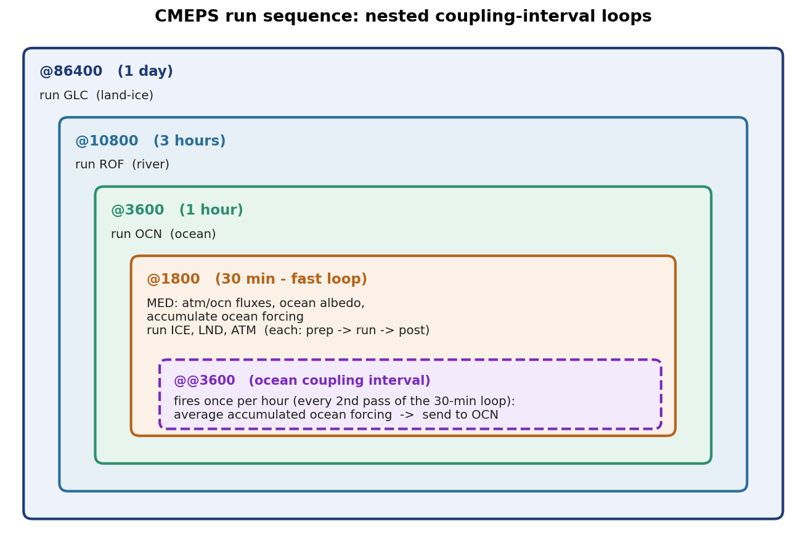

.. _run-sequence:

================
The run sequence
================

This page documents the *contents* of a run sequence — what each kind of line
means and how to read one. For what a run sequence *is* and how it fits into a
coupled run, see :ref:`concepts`.

The run sequence is a free-format ascii file which the NUOPC driver ingests at start-up (via
``NUOPC_DriverIngestRunSequence``).

For CESM/NorESM this is stored in the ``nuopc.runseq`` file. This file
is generated by the CIME case-control system from the coupling
intervals you configure; the generator lives in
``cime_config/runseq/`` and is CIME-only (see :ref:`running-a-case`).

For UFS this is stored in the ``runSeq`` file.

Anatomy of a run sequence
=========================

The run-sequence format below is the common NUOPC run-sequence format, whichever
host ingests it.

A run sequence is delimited by ``runSeq::`` and a closing ``::``. Between them,
four kinds of line appear:

Time-loop markers — ``@<dt>`` ... ``@``
   A line beginning with ``@`` followed by a number opens a **time loop** whose
   period is ``<dt>`` seconds; a line with a bare ``@`` closes the innermost
   open loop. Loops **nest**: an outer ``@<dt>`` typically wraps components
   coupled less frequently (for example land-ice, river, ocean), and the
   inner-most loop wraps the components coupled most frequently (for example
   atmosphere, land, sea ice). Everything between an opening ``@<dt>`` and its
   matching ``@`` executes once per ``<dt>`` interval.

   A doubled ``@@<dt>`` ... ``@@`` opens and closes a nested time loop in the
   same way; the doubled form is used to introduce an additional nesting level
   within a surrounding loop — for example to accumulate a field every fast
   interval but average it and send it to a component only on that component's
   (coarser) coupling interval.

Mediator phase calls — ``MED <phase>``
   A line ``MED <phase>`` runs the registered CMEPS phase named ``<phase>`` at
   that point in the sequence. These names are exactly the mediator phases
   described in the :ref:`architecture <architecture>` and Developer guides —
   for example ``med_phases_prep_ocn_accum``, ``med_phases_aofluxes_run``,
   ``med_phases_post_atm``.

Field transfers (connectors) — ``<SRC> -> <DST> :remapMethod=<method>``
   A line such as ``MED -> OCN :remapMethod=redist`` is a **connector**: it
   transfers the connected fields from the source to the destination — here from
   the mediator's export state to the ocean's import state — using the given
   remap method. ``ATM -> MED``, ``MED -> ATM`` and the like move fields into
   and out of the mediator.

Component runs — ``<COMP>``
   A bare component name such as ``ATM``, ``OCN``, ``ICE`` advances that
   component through one interval of the loop it sits in.

A worked example
================

The run sequence below is from a NorESM run and couples atmosphere, land, sea ice, ocean, river and
land-ice at several different intervals. Read it from the outermost loop inward.

   The nested coupling-interval loops of the example below. Each ``@<dt>`` opens
   a time loop at that interval, and the loops nest: components in the outer
   loops are coupled less frequently than those in the inner loops. The dashed
   ``@@3600`` block runs once per hour *inside* the 30-minute fast loop, where it
   averages the accumulated ocean forcing before sending it to the ocean.

.. code-block:: none

   runSeq::
   @86400
   @10800
   @3600
   @1800
     MED med_phases_aofluxes_run
     MED med_phases_prep_ocn_accum
     MED med_phases_ocnalb_run
     MED med_phases_diag_ocn
   @@3600
     MED med_phases_prep_ocn_avg
     MED -> OCN :remapMethod=redist
   @@
     MED med_phases_prep_lnd
     MED -> LND :remapMethod=redist
     MED med_phases_prep_ice
     MED -> ICE :remapMethod=redist
     ICE
     LND
     LND -> MED :remapMethod=redist
     MED med_phases_post_lnd
     MED med_phases_diag_lnd
     MED med_phases_diag_rof
     MED med_phases_diag_ice_ice2med
     MED med_phases_diag_glc
     ICE -> MED :remapMethod=redist
     MED med_phases_post_ice
     MED med_phases_prep_atm
     MED -> ATM :remapMethod=redist
     ATM
     ATM -> MED :remapMethod=redist
     MED med_phases_post_atm
     MED med_phases_diag_atm
     MED med_phases_diag_ice_med2ice
     MED med_phases_diag_accum
     MED med_phases_diag_print
   @
     OCN
     OCN -> MED :remapMethod=redist
     MED med_phases_post_ocn
   @
     MED med_phases_prep_rof
     MED -> ROF :remapMethod=redist
     ROF
     ROF -> MED :remapMethod=redist
     MED med_phases_post_rof
   @
     MED med_phases_prep_glc
     MED -> GLC :remapMethod=redist
     GLC
     GLC -> MED :remapMethod=redist
   ::

Reading this from the outside in:

* ``@86400`` / ``@10800`` / ``@3600`` / ``@1800`` open four nested time loops
  with periods of one day, three hours, one hour and thirty minutes. The
  land-ice, river and ocean work sits in the outer loops; the fastest work —
  atmosphere, land and sea ice — sits in the innermost 1800-second loop.
* Inside the fast loop, the mediator computes atmosphere/ocean fluxes and ocean
  albedos and **accumulates** the ocean forcing every 1800 s
  (``med_phases_prep_ocn_accum``).
* The ``@@3600`` ... ``@@`` block runs only on the ocean coupling interval: it
  **averages** the accumulated ocean forcing (``med_phases_prep_ocn_avg``) and
  transfers it to the ocean (``MED -> OCN``).
* Still in the fast loop, the mediator prepares and sends land and sea-ice
  fields, the ``LND`` and ``ICE`` components run and return their fields, the
  mediator post-processes them, prepares and sends the atmosphere forcing, the
  ``ATM`` component runs and returns, and diagnostics are written.
* The outer ``@`` blocks then run the ocean, river and land-ice components on
  their respective (coarser) intervals, each preceded by a ``prep_<comp>`` /
  ``MED -> <COMP>`` pair and followed by ``<COMP> -> MED`` / ``post_<comp>``.

.. note::

   The exact phases, components and intervals that appear in a run sequence
   depend on the configuration. The example above is illustrative; the run
   sequence in your run's ``nuopc.runseq`` reflects the components and
   coupling intervals you selected.
